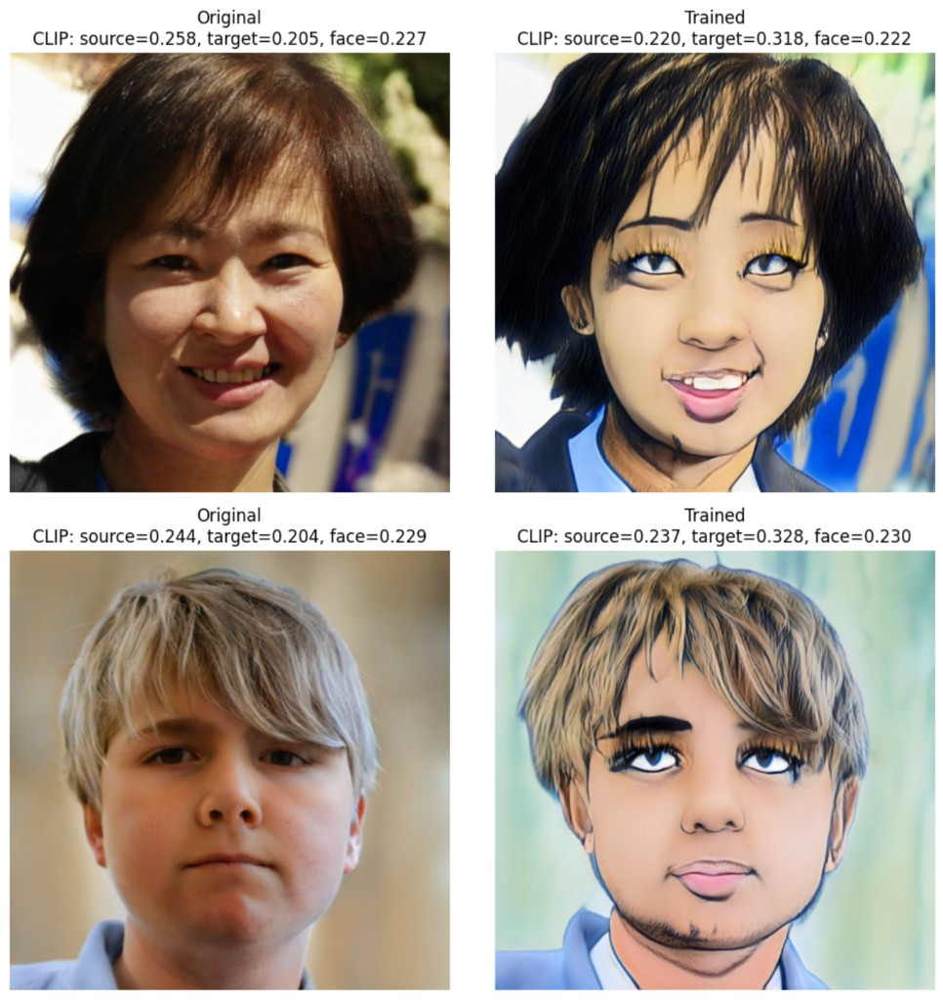

# StyleGAN2 + CLIP Finetuning (StyleGAN-NADA)

Implementation of the approach from [*StyleGAN-NADA: CLIP-Guided Domain Adaptation of Image Generators*](https://arxiv.org/abs/2108.00946).

---

## Inference: view generations (both versions, any epoch)

Use **[`StyleGAN2_NADA_Inference.ipynb`](StyleGAN2_NADA_Inference.ipynb)** to load a trained generator and generate samples (no training).

- Set **VERSION** (`"1"` or `"2"`) and **EPOCH** (e.g. 50, 100, 150, ... 500) in the first cells.
- Paste **one Google Drive link** to your checkpoints root folder (share: Anyone with the link).
- **Run All.** The notebook will list the folder structure and download only the checkpoint for the chosen VERSION/EPOCH.
- To compare **both versions** or **different epochs**: change VERSION and/or EPOCH, then **Run All** again. Already downloaded checkpoints are **not re-downloaded**; only the new one (if any) is fetched. So you can quickly switch between v1/v2 and 50/100/200/… and re-run to see new samples.

---

## Summary

Text-driven adaptation of a pretrained StyleGAN2 generator using CLIP. Specify source and target text prompts (e.g. "a photo of a face" → "a drawn anime style face"); the generator is finetuned so that generated images shift toward the target domain. No target-domain images needed.

**Idea:** The *direction* between source and generated images in CLIP space is aligned with the *direction* between source and target text. Directional CLIP loss: align ΔI (image) with ΔT (text).

Frozen generator *G_frozen* gives a reference image; trainable generator *G_train* gets the same latent *W* and is updated so that the direction (frozen image → trained image) in CLIP image space matches the direction (source text → target text) in CLIP text space.

---

## Storage: Google Drive or local (training notebooks)

In **v1** and **v2** training notebooks you can choose where to store models, repos, checkpoints, and output:

- **Google Drive** — set `USE_GOOGLE_DRIVE = True` in Step 1. Drive is mounted; data persists across Colab sessions.
- **Local** — set `USE_GOOGLE_DRIVE = False`. Uses `/content/StyleGAN_NADA` with the same folder structure; data is lost when the session ends.

Same variable `USE_GOOGLE_DRIVE` in the first cells of each training notebook; no other changes needed.

---

## StyleGAN2_NADA v1

[`StyleGAN2_NADA v1.ipynb`](StyleGAN2_NADA%20v1.ipynb) — Training notebook (Colab).

In v1 we train the **synthesis network as a whole** (mapping frozen). No adaptive layer freezing or latent mapper; straightforward directional CLIP loss.

**Example (photo → anime):**

*[v1_results.png](assets/v1_results.png)*

---

## StyleGAN2_NADA v2

[`StyleGAN2_NADA v2.ipynb`](StyleGAN2_NADA%20v2.ipynb) — Training notebook (Colab) with **adaptive layer-freezing** (paper Sec 4.2).

In v2, each iteration first selects *k* synthesis layers via latent optimization (global CLIP loss), then trains only those layers with the directional loss. This reduces instability and memory use on strong domain shifts.

**Example (photo → cartoon/anime):** Original vs trained with CLIP metrics (source, target, face).

*[v2_results.png](assets/v2_results.png)*

---

## References

- **Paper:** [StyleGAN-NADA: CLIP-Guided Domain Adaptation of Image Generators](https://arxiv.org/abs/2108.00946)
- **StyleGAN2:** [NVlabs/stylegan2](https://github.com/NVlabs/stylegan2)
- **StyleGAN2-PyTorch:** [rosinality/stylegan2-pytorch](https://github.com/rosinality/stylegan2-pytorch)
- **CLIP:** [openai/CLIP](https://github.com/openai/CLIP)
- **StyleGAN-NADA (official):** [rinongal/stylegan-nada](https://github.com/rinongal/stylegan-nada)
