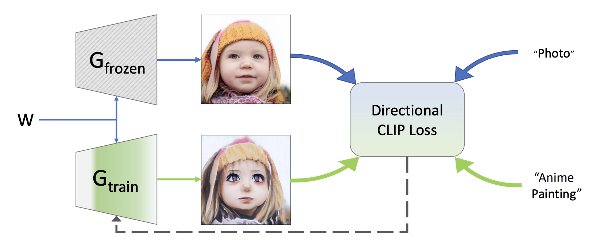

# StyleGAN2 + CLIP Finetuning (StyleGAN-NADA)

Implementation of the approach from [*StyleGAN-NADA: CLIP-Guided Domain Adaptation of Image Generators*](https://arxiv.org/abs/2108.00946).

---

## Summary

Text-driven adaptation of a pretrained StyleGAN2 generator using CLIP. Specify source and target text prompts (e.g. "a photo of a face" → "a drawn anime style face"); the generator is finetuned so that generated images shift toward the target domain. No target-domain images needed.

**Idea:** The *direction* between source and generated images in CLIP space is aligned with the *direction* between source and target text. Directional CLIP loss: align ΔI (image) with ΔT (text).

Frozen generator *G_frozen* gives a reference image; trainable generator *G_train* gets the same latent *W* and is updated so that the direction (frozen image → trained image) in CLIP image space matches the direction (source text → target text) in CLIP text space.

---

## StyleGAN2_CLIP_Finetuning v1

[`StyleGAN2_CLIP_Finetuning v1.ipynb`](StyleGAN2_CLIP_Finetuning%20v1.ipynb) — Colab notebook on Google Drive.

In v1 we train the **synthesis network as a whole** (mapping frozen). No adaptive layer freezing or latent mapper; straightforward directional CLIP loss.

**Example (photo → anime):**

---

## References

- **Paper:** [StyleGAN-NADA: CLIP-Guided Domain Adaptation of Image Generators](https://arxiv.org/abs/2108.00946)
- **StyleGAN2:** [NVlabs/stylegan2](https://github.com/NVlabs/stylegan2)
- **StyleGAN2-PyTorch:** [rosinality/stylegan2-pytorch](https://github.com/rosinality/stylegan2-pytorch)
- **CLIP:** [openai/CLIP](https://github.com/openai/CLIP)
- **StyleGAN-NADA (official):** [rinongal/stylegan-nada](https://github.com/rinongal/stylegan-nada)
